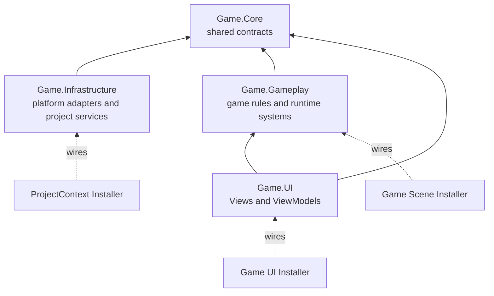
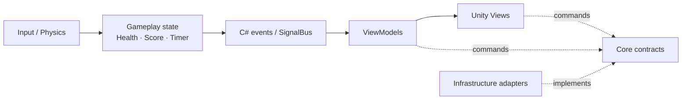
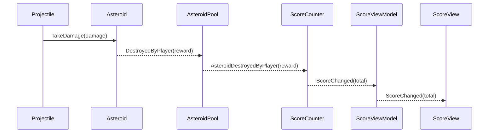
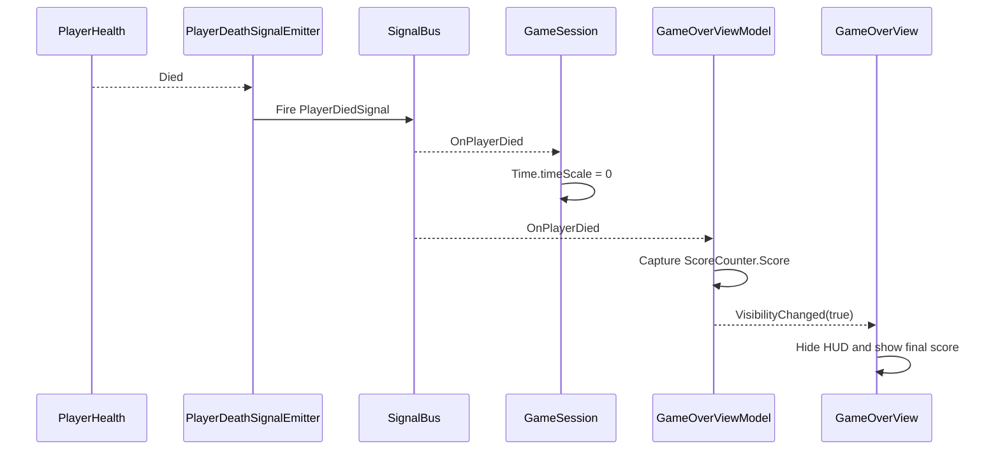

# 2D Asteroids Survival

Architecture-focused endless 2D survival game built with Unity 2022 LTS and C#.

The project is a compact graduation project and public code sample demonstrating explicit dependencies, assembly boundaries, lifecycle-safe communication, asynchronous scene flow, data-driven difficulty, MVVM-style UI, and pooled runtime objects.

Portfolio: https://tokarevdev.github.io/

Status: playable end-to-end game / final polish in progress

## Quick Review

Portfolio-relevant code lives under `Assets/_Project/`.

Start here:

- Core abstractions: `Assets/_Project/Core/`
- Composition root and infrastructure: `Assets/_Project/Infrastructure/`
- Gameplay systems: `Assets/_Project/Gameplay/`
- UI and ViewModel flow: `Assets/_Project/UI/`
- Assembly boundaries: `Game.Core`, `Game.Infrastructure`, `Game.Gameplay`, `Game.UI`
- Runtime architecture walkthrough: [How To Read The Project](#how-to-read-the-project)

## Overview

The player moves inside responsive camera bounds and automatically fires pooled projectiles while data-driven asteroids enter from randomized positions. Destroying small, medium, and large asteroids awards different score values, while spawn frequency progressively increases during the run.

The HUD displays health, survival time, and score. Player death is propagated through Zenject SignalBus, pauses the session, hides the gameplay HUD, and opens a game-over screen with the final score, restart, and main-menu navigation.

The project intentionally keeps the gameplay scope focused so the architecture remains easy to inspect. It demonstrates production-oriented Unity practices without hiding them behind a large content layer.

## Architecture

Arrows show compile-time dependency direction: the outer layer knows the inner contract, never the other way around. `Game.Core` does not know about AdMob, concrete input actions, scenes, gameplay models, or UI. Scene and project installers are composition roots: they are the only places expected to know which concrete implementation satisfies each contract.

### Assembly Definition Boundaries

- `Game.Core` contains shared abstractions such as `IInputReader`, `ISceneLoader`, and `IAdvertisementService`.
- `Game.Infrastructure` implements input, async scene loading, bootstrap, advertising, and project-level Zenject bindings.
- `Game.Gameplay` owns combat, player, asteroid, projectile, score, survival timer, session, and gameplay signal logic.
- `Game.UI` owns the main menu, gameplay HUD, navigation, advertising presentation, and game-over View/ViewModel flow.

These boundaries make dependencies visible, reduce accidental coupling, and keep infrastructure and presentation concerns outside core gameplay classes.

### How To Read The Project

Use this mental model:

1. **Core defines vocabulary.** It contains contracts that multiple assemblies may use.
2. **Infrastructure talks to Unity or an SDK.** Input System, scene loading, and AdMob live here.
3. **Gameplay owns game truth.** Health, score, time, spawning, movement, damage, and session state do not belong to UI.
4. **UI translates game truth for the player.** ViewModels observe models and expose presentation state; Views only render state and forward button commands.
5. **Installers connect the graph.** Zenject constructs services and ViewModels, so runtime code does not search the scene or create hidden global dependencies.

The most important rule is that data flows outward to presentation while dependencies point inward toward contracts:

### Runtime Ownership And Lifecycle

| Lifetime | Created by | Examples | Cleanup |
| --- | --- | --- | --- |
| Application | `ProjectContext` | `InputReader`, `SceneLoader`, `AdMobAdvertisementService` | Zenject calls `IDisposable.Dispose` |
| Game scene | `GameInstaller` | `SurvivalTimer`, `ScoreCounter`, `GameSession` | Scene container disposes subscriptions and restores time scale |
| Game UI | `GameUIInstaller` | HUD and game-over ViewModels | Scene container disposes model/signal subscriptions |
| Scene object | Unity scene/prefab | Player, spawner, pools, Views | `OnDisable`/`OnDestroy` remove listeners and release local resources |
| Pooled entity | Projectile/asteroid pool | Projectiles and asteroids | State and velocity reset on return; object is disabled and reused |

This ownership model answers two practical questions when adding a feature: **who creates it?** and **who is responsible for cleaning it up?** If neither answer is clear, the dependency probably belongs in an installer or the class has too many responsibilities.

### Score And Game-Over Event Flow

`PlayerHealth` does not open UI, and `GameOverView` does not pause gameplay. SignalBus lets both reactions happen independently from the same domain event.

### Composition Root And Dependency Injection

- `ProjectContext` and scene installers act as composition roots.
- Zenject binds project services, gameplay models, ViewModels, and SignalBus dependencies.
- Pure C# services use constructor injection; scene `MonoBehaviour` components use explicit Zenject method injection.
- Gameplay and UI consume interfaces or injected services instead of searching the scene at runtime.
- Serialized scene references remain explicit for local Unity object relationships.

### Async Scene Flow

- `SceneLoader` exposes `UniTask`-based transitions through `ISceneLoader`.
- A dedicated bootstrap scene loads the main menu.
- Menu, gameplay, and game-over navigation disable repeated interaction while a transition is running.
- Exceptions are surfaced through `Debug.LogException` rather than silently ignored.

### Event And MVVM-Style UI Flow

- `PlayerHealth` exposes state changes without controlling UI.
- `PlayerDeathSignalEmitter` forwards death through Zenject SignalBus.
- `GameSession` owns session-ending behavior and time-scale state.
- `HealthViewModel`, `TimerViewModel`, and `ScoreViewModel` translate gameplay state into HUD state.
- `GameOverViewModel` converts gameplay signals into visibility, interaction, and navigation state.
- `GameOverView` presents the final score, hides the gameplay HUD, and binds Unity UI controls to ViewModel state and commands.

## Design Patterns

### GoF Observer

Observer is the primary GoF pattern used by the project.

- `Health` publishes health-change and death events.
- `ScoreCounter` publishes score changes.
- ViewModels observe gameplay models and expose presentation state to their Views.
- Zenject SignalBus publishes `PlayerDiedSignal` to independent session and UI consumers.

Observer was selected because one gameplay event can affect multiple systems without the sender holding direct references to them. For example, player death independently pauses the session and opens the game-over UI. This keeps gameplay, session control, and presentation loosely coupled.

### Supporting Patterns And Practices

- **Object Pool** reuses projectiles and asteroids instead of repeatedly calling `Instantiate` and `Destroy`.
- **Dependency Injection / IoC** is implemented with Zenject.
- **Composition Root** is represented by `ProjectContext` and scene installers.
- **MVVM-style presentation** separates gameplay state, ViewModels, and Unity UI Views.
- **Adapter-style boundaries** connect pure C# models such as `Health` to Unity `MonoBehaviour` lifecycles.
- **Data-driven configuration** uses `AsteroidConfig` ScriptableObjects for asteroid variants and balance.

## Key Systems

### Data-Driven Asteroids

- `AsteroidConfig` ScriptableObjects define health, movement speed, sprite, scale, and score reward.
- Small, medium, and large variants reuse the same runtime behavior.
- Asteroid collision damage is derived from remaining health.
- Spawn frequency progressively increases over time and is clamped to a configured minimum interval.

### Reusable Combat Model

- Pure C# `Health` owns damage, death, and change events.
- `IDamageable` decouples projectiles and asteroid impacts from concrete targets.
- `PlayerHealth` and `Asteroid` adapt the shared model to MonoBehaviour lifecycles.

### Object Pooling

- Projectile and asteroid pools are prewarmed.
- `Queue<T>` provides reuse order while `HashSet<T>` prevents duplicate returns.
- Runtime entities reset movement and hit state before reuse.
- Frequently spawned objects avoid repeated `Instantiate`/`Destroy` churn during gameplay.

### Input And Movement

- Unity Input System is wrapped by `IInputReader`.
- The generated input actions are owned and disposed by `InputReader`.
- Rigidbody2D references are cached in `Awake` and movement runs in `FixedUpdate`.
- Player bounds are cached and refreshed only when camera aspect or orthographic size changes.

### Score And Session UI

- Player-destroyed asteroids award 100, 200, or 500 points depending on their configured variant.
- Collision and despawn paths do not award score.
- The HUD displays current health, survival time, score, and direct main-menu navigation.
- Game over freezes the session, hides the HUD, and displays the final score.
- Restart and scene-navigation actions are guarded against duplicate requests.

### Advertising

- Google Mobile Ads is isolated behind `IAdvertisementService`.
- `AdMobAdvertisementService` is created once by the project-level Zenject container.
- The main menu requests a test banner through a dedicated presentation component.
- The banner is destroyed when leaving the menu and recreated when returning, keeping its native lifecycle aligned with scene flow.
- Official Google test identifiers are used; production AdMob identifiers are intentionally not stored in the repository.

## Lifecycle And Performance Practices

- Event subscriptions are paired across `OnEnable`/`OnDisable`, `Awake`/`OnDestroy`, or `IInitializable`/`IDisposable`.
- No `FindObjectOfType`, `GameObject.Find`, tag lookup, or repeated component lookup is used in hot paths.
- Required Rigidbody2D components are resolved once and cached.
- ScriptableObject configuration avoids per-instance duplicated balance data.
- Pooling reduces managed/native object churn for projectiles and asteroids.
- Update loops contain direct value operations without LINQ or per-frame collection allocation.

## Gameplay Flow

1. Bootstrap loads the main menu asynchronously.
2. The player starts the game through an injected scene loader.
3. Asteroids spawn from configurable variants and move toward randomized lower-screen targets.
4. The player moves within cached screen bounds and automatically fires pooled projectiles.
5. Destroyed asteroids award variant-specific score while spawn frequency increases over time.
6. Player death ends the session and opens the game-over UI through SignalBus and ViewModel state.
7. The HUD is hidden and the final score is presented.
8. Restart and main-menu transitions are guarded against duplicate input.

## Tech Stack

- Unity 2022.3 LTS
- C#
- Unity Input System
- Physics2D
- UGUI / TextMeshPro
- Zenject dependency injection and SignalBus
- UniTask
- Assembly Definitions
- ScriptableObjects
- Object pooling
- MVVM-style presentation boundaries
- Google Mobile Ads

## Graduation Requirements Coverage

| Requirement | Implementation |
| --- | --- |
| Endless gameplay | Survival loop with progressively increasing asteroid spawn frequency |
| GoF pattern | Observer through C# events and Zenject SignalBus |
| Zenject and SignalBus | Project/scene composition roots and `PlayerDiedSignal` flow |
| Assembly Definitions | `Game.Core`, `Game.Infrastructure`, `Game.Gameplay`, and `Game.UI` |
| Menu and gameplay UI | Main menu, HUD, gameplay navigation, and game-over screen |
| Advertising | Google Mobile Ads test banner integrated behind an abstraction |
| Code quality | Explicit dependencies, lifecycle cleanup, pooling, and separated presentation |
| MonoBehaviour / pure C# split | Unity adapters and Views around pure models, services, and ViewModels |

## Current Scope

This repository is a graduation project and architecture/gameplay systems sample, not a shipped commercial release. The core survival loop, progression, score, navigation, combat, pooling, advertising, HUD, and game-over flow are playable. Persistent high score, audio/VFX polish, automated gameplay tests, and release packaging remain future work.

## Run Locally

1. Open the repository with Unity `2022.3.62f3` or a compatible Unity 2022.3 LTS patch.
2. Open `Assets/_Project/Scenes/Bootstrap.unity`.
3. Enter Play Mode.

The enabled build-scene order is Bootstrap, MainMenu, and Game.

## Author

Oleksandr Tokarev

Unity Developer | C# Gameplay Programmer

Email: otokarevdev@gmail.com

Portfolio: https://tokarevdev.github.io/
