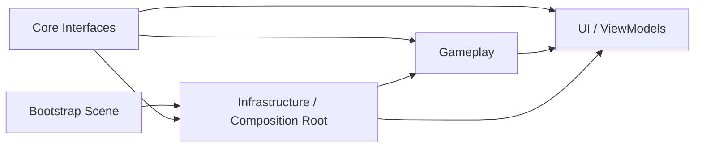

# 2D Asteroids Survival

Architecture-focused 2D survival prototype built with Unity 2022 LTS and C#.

The project is a compact public code sample demonstrating how I structure a Unity gameplay feature with explicit dependencies, assembly boundaries, lifecycle-safe communication, asynchronous scene flow, and pooled runtime objects.

Portfolio: https://tokarevdev.github.io/

Status: playable architecture prototype / work in progress

## Quick Review

Portfolio-relevant code lives under `Assets/_Project/`.

Start here:

- Core abstractions: `Assets/_Project/Core/`
- Composition root and infrastructure: `Assets/_Project/Infrastructure/`
- Gameplay systems: `Assets/_Project/Gameplay/`
- UI and ViewModel flow: `Assets/_Project/UI/`
- Assembly boundaries: `Game.Core`, `Game.Infrastructure`, `Game.Gameplay`, `Game.UI`

## Overview

The player moves inside camera bounds and automatically fires pooled projectiles while data-driven asteroids enter from randomized positions. Asteroid health determines collision damage, projectiles and asteroids are reused through dedicated pools, and player death is propagated through a signal-driven session/UI flow.

The project intentionally keeps the gameplay scope small so the architecture remains easy to inspect. It demonstrates production-oriented Unity practices without hiding them behind a large content layer.

## Architecture

### Assembly Definition Boundaries

- `Game.Core` contains engine-facing abstractions such as `IInputReader` and `ISceneLoader`.
- `Game.Infrastructure` implements input, async scene loading, bootstrap, and project-level Zenject bindings.
- `Game.Gameplay` owns combat, player, asteroid, projectile, session, and gameplay signal logic.
- `Game.UI` owns menu and game-over presentation plus `GameOverViewModel`.

These boundaries make dependencies visible, reduce accidental coupling, and keep infrastructure and presentation concerns outside core gameplay classes.

### Composition Root And Dependency Injection

- `ProjectContext` and scene installers act as composition roots.
- Zenject binds `ISceneLoader`, `IInputReader`, `GameSession`, `GameOverViewModel`, and SignalBus dependencies.
- Gameplay and UI consume interfaces or injected services instead of searching the scene at runtime.
- Serialized scene references remain explicit for local Unity object relationships.

### Async Scene Flow

- `SceneLoader` exposes `UniTask`-based transitions through `ISceneLoader`.
- A dedicated bootstrap scene loads the main menu.
- Menu and game-over actions disable repeated interaction while a transition is running.
- Exceptions are surfaced through `Debug.LogException` rather than silently ignored.

### Event And MVVM-Style UI Flow

- `PlayerHealth` exposes state changes without controlling UI.
- `PlayerDeathSignalEmitter` forwards death through Zenject SignalBus.
- `GameSession` owns session-ending behavior and time-scale state.
- `GameOverViewModel` converts gameplay signals into visibility, interaction, and navigation state.
- `GameOverView` only binds Unity UI controls to ViewModel state and commands.

## Key Systems

### Data-Driven Asteroids

- `AsteroidConfig` ScriptableObjects define health, movement speed, sprite, and scale.
- Small, medium, and large variants reuse the same runtime behavior.
- Asteroid collision damage is derived from remaining health.

### Reusable Combat Model

- Pure C# `Health` owns damage, death, and change events.
- `IDamageable` decouples projectiles and asteroid impacts from concrete targets.
- `PlayerHealth` and `Asteroid` adapt the shared model to MonoBehaviour lifecycles.

### Object Pooling

- Projectile and asteroid pools are prewarmed.
- `Queue<T>` provides reuse order while `HashSet<T>` prevents duplicate returns.
- Runtime entities reset movement and hit state before reuse.
- Frequently spawned objects avoid repeated `Instantiate`/`Destroy` churn during gameplay.

### Input And Movement

- Unity Input System is wrapped by `IInputReader`.
- The generated input actions are owned and disposed by `InputReader`.
- Rigidbody2D references are cached in `Awake` and movement runs in `FixedUpdate`.
- Player bounds are cached and refreshed only when camera aspect or orthographic size changes.

## Lifecycle And Performance Practices

- Event subscriptions are paired across `OnEnable`/`OnDisable`, `Awake`/`OnDestroy`, or `IInitializable`/`IDisposable`.
- No `FindObjectOfType`, `GameObject.Find`, tag lookup, or repeated component lookup is used in hot paths.
- Required Rigidbody2D components are resolved once and cached.
- ScriptableObject configuration avoids per-instance duplicated balance data.
- Pooling reduces managed/native object churn for projectiles and asteroids.
- Update loops contain direct value operations without LINQ or per-frame collection allocation.

## Gameplay Flow

1. Bootstrap loads the main menu asynchronously.
2. The player starts the game through an injected scene loader.
3. Asteroids spawn from configurable variants and move toward randomized lower-screen targets.
4. The player moves within cached screen bounds and automatically fires pooled projectiles.
5. Player death ends the session and opens the game-over UI through SignalBus and ViewModel state.
6. Restart and main-menu transitions are guarded against duplicate input.

## Tech Stack

- Unity 2022.3 LTS
- C#
- Unity Input System
- Physics2D
- UGUI / TextMeshPro
- Zenject dependency injection and SignalBus
- UniTask
- Assembly Definitions
- ScriptableObjects
- Object pooling
- MVVM-style presentation boundaries

## Current Scope

This repository is an architecture and gameplay systems sample, not a shipped commercial release. The current scope covers the core survival loop, navigation, combat, pooling, and game-over flow. Content progression, audio/VFX polish, automated gameplay tests, and release packaging are future work.

## Run Locally

1. Open the repository with Unity `2022.3.62f3` or a compatible Unity 2022.3 LTS version.
2. Open `Assets/_Project/Scenes/Bootstrap.unity`.
3. Enter Play Mode.

The enabled build-scene order is Bootstrap, MainMenu, and Game.

## Author

Oleksandr Tokarev

Unity Developer | C# Gameplay Programmer

Email: otokarevdev@gmail.com

Portfolio: https://tokarevdev.github.io/
